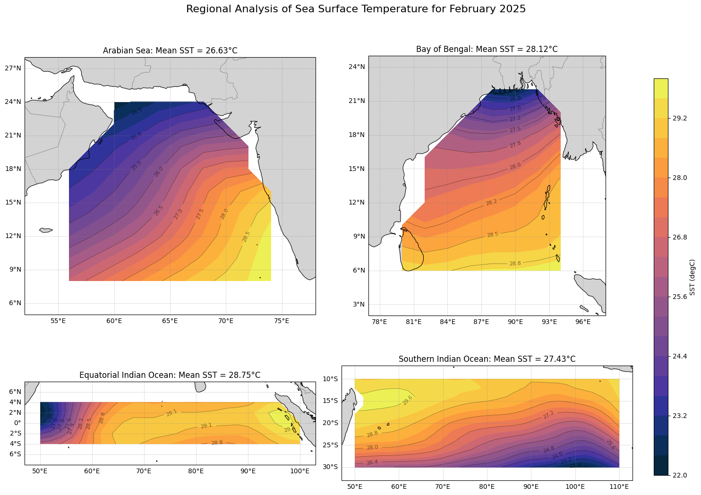
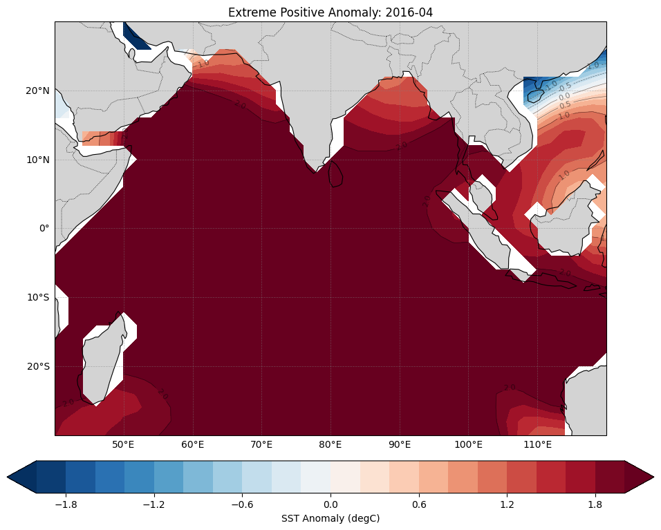
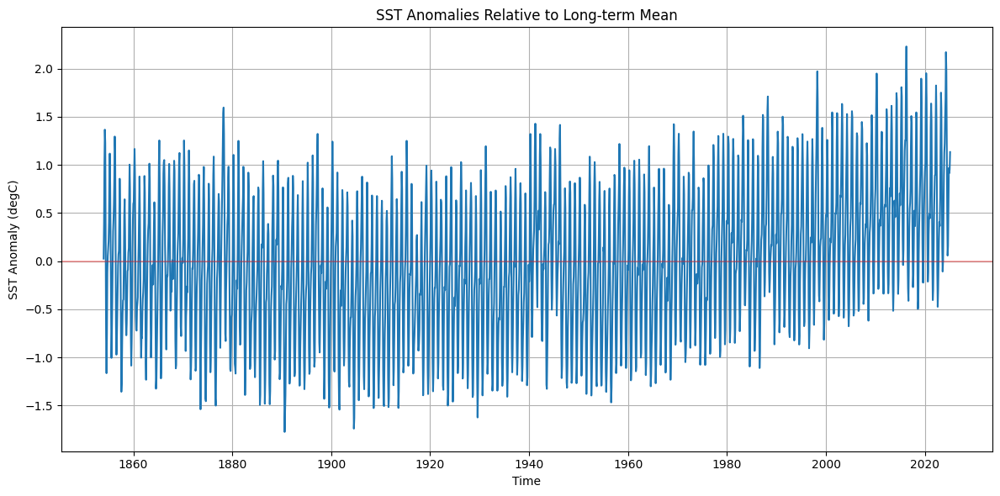

# Oceanographic Analysis Projects

This repository contains oceanographic data analysis projects focused on the Indian Ocean region, with emphasis on regional sea surface temperature patterns and Sri Lanka coastal chlorophyll concentrations. These projects demonstrate the application of Python-based data analysis techniques to oceanographic remote sensing data.

## Projects Overview

### 1. Indian Ocean SST Analysis
Analysis of Sea Surface Temperature patterns across the Indian Ocean with seasonal and regional focus. This project has evolved through multiple versions:

- **Version 2.0.0** (Latest): Enhanced documentation, comprehensive regional analysis, and improved visualization techniques.
- **Version 1.0.0**: Initial implementation with flexible file selection and basic analysis.

**Key Features:**
- Flexible data file selection for different SST datasets
- Seasonal temperature patterns analysis
- Regional focus on the Arabian Sea and Bay of Bengal
- Enhanced geographical visualization using Cartopy
- Statistical analysis with proper spatial weighting

### 2. Sri Lanka Regional Chlorophyll Analysis

Analysis of Chlorophyll-a concentration patterns around Sri Lanka with monsoon-based seasonal analysis.

**Key Features:**
- Custom regions around Sri Lanka's coastal waters
- Monsoon season-based temporal analysis
- Regional analysis of different coastal areas (West Coast, East Coast, South Coast, Palk Strait)
- Statistical outputs with proper versioning
- Automated figure generation with timestamps

## Data Sources

- **SST Data**: Extended Reconstructed Sea Surface Temperature (ERSST) datasets and NOAA operational daily SST products
- **Chlorophyll Data**: ESA CCI Ocean Colour Product data

## Technical Implementation

### Technologies Used
- Python 3.12.7
- xarray for multidimensional data analysis
- matplotlib for general plotting
- numpy for numerical computations
- cartopy for geospatial visualization
- Jupyter Notebooks for interactive analysis

### Project Structure
```
Repository/
├── indian_ocean_sst/
│   ├── indian_ocean_sst_seasonal_analysis.ipynb - Original SST analysis
│   ├── flexible_sst_analysis.v1.ipynb - Version 1 with flexible file selection
│   └── Flexible_Indian_Ocean_SST_Analysis_v2.0.0.ipynb - Latest version with enhanced documentation
├── sri_lanka_chlorophyll/
│   └── SL_Regional_Chlor_Monsoon_Analysis_v1.2.0.ipynb - Sri Lanka chlorophyll analysis
└── sample_outputs/
    └── (visualization examples)
```

## Getting Started

### Requirements
```
Python 3.12.7
xarray
matplotlib
numpy
cartopy
jupyter
netCDF4
```

### Installation Instructions
```bash
conda create -n ocean_analysis python=3.12.7
conda activate ocean_analysis
conda install xarray matplotlib numpy cartopy jupyter netCDF4
```

### Sample Visualizations

  
*Key SST patterns from v2.0 notebook*

  
*Regional seasonal contrasts (e.g., Arabian Sea vs Bay of Bengal)*

  
*High-quality Cartopy map with spatial statistics*

### Sea Surface Temperature Analysis

*Seasonal temperature patterns across the Indian Ocean region with detailed geographical features.*

### Chlorophyll Analysis

*Chlorophyll-a concentration analysis around Sri Lanka's coastal waters during different monsoon seasons.*

## Future Work

- Land masking for improved coastal analysis
- Integration with meteorological data
- Incorporation of higher resolution datasets
- Extended time-series analysis for climate change indicators
- Expansion to include salinity and ocean current analysis

## Contributors

- [Keerthi Abe](https://www.linkedin.com/in/keerthiabe/) - Primary Author
- [Thivin Abeywickrama](https://www.linkedin.com/in/thivin-abeywickrama-54566b180/) - Project Supervisor 

## License

This project is licensed under the MIT License - see the LICENSE file for details.
