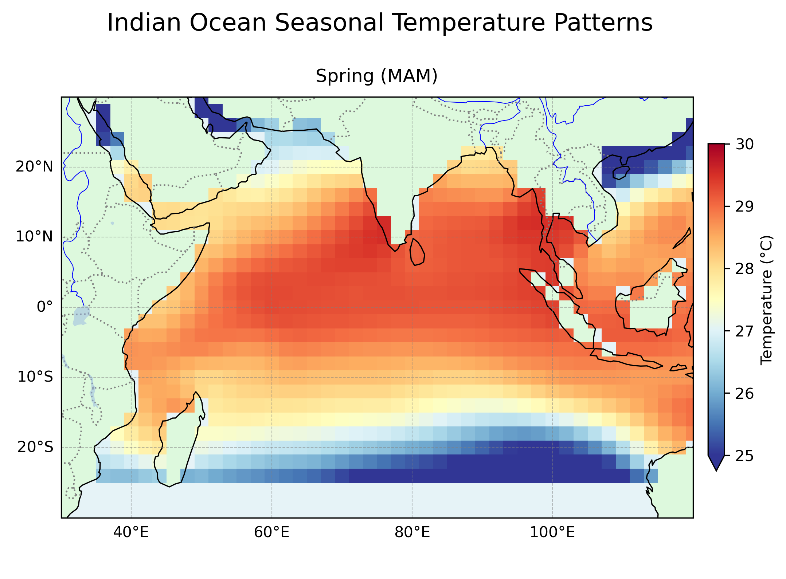

# Oceanographic Analysis Projects

This repository contains oceanographic data analysis projects focused on the Indian Ocean region, with emphasis on Sri Lanka coastal waters. These projects analyze both Sea Surface Temperature (SST) patterns and Chlorophyll-a concentrations using Python and Jupyter Notebooks.

## Projects

### 1. Indian Ocean SST Analysis

Analysis of Sea Surface Temperature patterns across the Indian Ocean with seasonal and regional focus.

**Key Features:**
- Flexible data file selection for different SST datasets
- Seasonal temperature patterns analysis
- Regional focus on the Arabian Sea and Bay of Bengal
- Enhanced geographical visualization using Cartopy
- Statistical analysis with proper spatial weighting

### 2. Sri Lanka Regional Chlorophyll Analysis

Analysis of Chlorophyll-a concentration patterns around Sri Lanka with monsoon-based seasonal analysis.

**Key Features:**
- Custom regions around Sri Lanka's coastal waters
- Monsoon season-based temporal analysis
- Regional analysis of different coastal areas (West Coast, East Coast, South Coast, Palk Strait)
- Statistical outputs with proper versioning
- Automated figure generation with timestamps

## Data Sources

- SST Data: Extended Reconstructed Sea Surface Temperature (ERSST) datasets
- Chlorophyll Data: ESA CCI Ocean Colour Product data

## Technical Implementation

### Technologies Used
- Python 3.12.7
- xarray for multidimensional data analysis
- matplotlib for general plotting
- numpy for numerical computations
- cartopy for geospatial visualization
- Jupyter Notebooks for interactive analysis

### Project Structure
```
Repository/
├── indian_ocean_sst_seasonal_analysis.ipynb - Original SST analysis
├── flexible_sst_analysis.ipynb - Enhanced version with flexible file selection
├── SL_Regional_Chlor_Monsoon_Analysis_v1.2.0.ipynb - Sri Lanka chlorophyll analysis
└── sample_outputs/ (sample visualizations)
```

## Getting Started

### Requirements
```
Python 3.12.7
xarray
matplotlib
numpy
cartopy
jupyter
netCDF4
```

### Installation Instructions
```bash
conda create -n ocean_analysis python=3.12.7
conda activate ocean_analysis
conda install xarray matplotlib numpy cartopy jupyter netCDF4
```

## Sample Output Visualizations

The analysis produces various visualizations including:
- Seasonal temperature cycle plots
- Regional temperature distribution maps
- Monsoon-based chlorophyll concentration maps
- Regional coastal water analysis for Sri Lanka

### Sea Surface Temperature Analysis

*Seasonal temperature patterns across the Indian Ocean region with detailed geographical features.*

### Chlorophyll Analysis

*Chlorophyll-a concentration analysis around Sri Lanka's coastal waters during different monsoon seasons.*

## Future Work

- Land masking for improved coastal analysis
- Integration with meteorological data
- Incorporation of higher resolution datasets
- Extended time-series analysis for climate change indicators
- Expansion to include salinity and ocean current analysis

## Author

[Keerthi Abe](https://www.linkedin.com/in/keerthiabe/)

## License

This project is licensed under the MIT License - see the LICENSE file for details.
